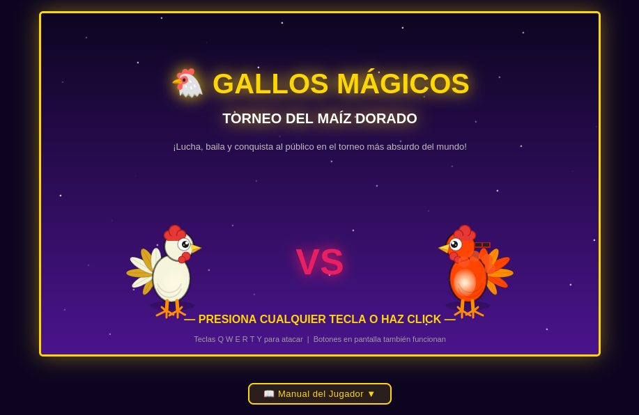

# Gallos Mágicos – Torneo del Maíz Dorado

Juego de lucha cómica 2D en el navegador. Combate contra gallos elementales autónomos, absorbe sus poderes y conquista al público acumulando puntos de **humor** y **estilo** para ganar el Gran Torneo del Maíz Dorado.

---



---

## Cómo jugar

Abre `gallos-magicos/index.html` directamente en el navegador. No requiere servidor ni compilación.

## Instalación

1. Descarga o clona el repositorio.
2. Verifica que la carpeta `assets/img` contenga la portada `image.png`.
3. Abre el archivo `gallos-magicos/index.html` con cualquier navegador moderno.

```
gallos-magicos-JDML/
└── gallos-magicos/
    └── index.html   ← abrir aquí
```

---

## Controles

| Tecla | Habilidad           | Disponible desde |
| ----- | ------------------- | ---------------- |
| `Q`   | 🐔 Picotazo         | Inicio           |
| `W`   | 🔥 Llamarada Disco  | Etapa 2          |
| `E`   | 💨 Soplido Inflador | Etapa 3          |
| `R`   | ⚡ Rayo Guitarra    | Etapa 4          |
| `T`   | 🌽 Trampa Espigas   | Etapa 5          |
| `Y`   | 🎉 ¡ULTRA CONFETI!  | Forma final      |

También puedes hacer clic en los botones que aparecen debajo del canvas.  
Durante la batalla, haz **clic sobre los premios** que caen en pantalla para recogerlos.

---

## Mecánicas de combate

### Barras de estado

| Barra      | Color   | Descripción                                               |
| ---------- | ------- | --------------------------------------------------------- |
| ❤️ Energía | Rojo    | Barra de vida. Llega a 0 → derrota.                       |
| 😂 Humor   | Verde   | Se acumula atacando con variedad y ovaciones del público. |
| ✨ Estilo  | Púrpura | Aumenta con combos variados; penaliza ataques repetidos.  |

### Multiplicador de espectáculo

El multiplicador de daño sube en función de **Humor + Estilo**:

| Puntos combinados | Multiplicador                           | Nota                           |
| ----------------- | --------------------------------------- | ------------------------------ |
| 0 – 100           | ×1.0 (normal)                           |                                |
| > 100             | ×1.5                                    |                                |
| > 150             | ×2.0 · ×2.5 con Arcoíris Supremo        | ×2.5 exclusivo de la forma final |
| **≥ 200**         | **Victoria automática por espectáculo** |                                |

### Sistema de combo y público

- **Ovación** (+6 humor): al usar una habilidad distinta a la anterior.
- **Tomatazo** (−5 humor, −10 estilo): al repetir el mismo ataque.
- **Combo x3** (+12 estilo): usar 3 habilidades distintas en fila.

### Condiciones de victoria

1. Vaciar la barra de **Energía** del rival (100 pts).
2. Alcanzar **200 pts de Espectáculo** (Humor + Estilo) → victoria automática.

### Efectos de ataque (proyectiles)

Cada habilidad genera un proyectil que viaja del atacante al objetivo en ~350 ms. El proyectil tiene estela de partículas y orbe pulsante con color propio. El rayo eléctrico (⚡) añade un trazo zigzag. Al impactar, explota en un burst de partículas.

### Premios cómicos

Durante la batalla caen premios desde la parte superior del escenario. Haz clic sobre ellos para recogerlos antes de que desaparezcan (5–10 s):

| Emoji | Nombre             | Curación  | Bonus       | Frecuencia |
| ----- | ------------------ | --------- | ----------- | ---------- |
| 🌽    | Maíz pequeño       | +10 Energía | —          | 50 %       |
| 🍿    | Palomitas mágicas  | +20 Energía | —          | 30 %       |
| 🥚    | Huevo Dorado       | +40 Energía | —          | 15 %       |
| 🎉    | ¡Confeti Arcoíris! | +100 Energía | +20 Humor | 5 %        |

### Cuervo ladrón (etapas 3 y 4)

A partir de la etapa 3 (Arena de Patos Fans) aparece un **cuervo oscuro con ojos naranjas** que entra volando desde el borde de la pantalla y apunta al premio más antiguo que haya en el suelo. Un indicador **⚠️** parpadea sobre el premio amenazado.

- Si el jugador no recoge el premio a tiempo, el cuervo lo roba y huye llevándolo en las garras.
- Mensaje al robo: `🐦 ¡El cuervo robó [emoji]!`
- **Etapa 3** — velocidad 3.5 px/frame, aparece cada 10–18 s.
- **Etapa 4** — velocidad 5.0 px/frame, aparece cada 6–11 s.

---

## Progresión del torneo

| Etapa | Escenario                 | Rival           | Transformación ganada      | Bonus                 | Daño enemigo | Intervalo ataque |
| ----- | ------------------------- | --------------- | -------------------------- | --------------------- | ------------ | ---------------- |
| 1     | Granero Encantado         | Gallo de Fuego  | 🔥 Gallo Llamas Disco      | +20 humor, +10 estilo | 8–15         | ~3.45 s          |
| 2     | Volcán de Palomitas       | Gallo de Viento | 💨 Gallo Globo             | +15 humor, +15 estilo | 12–20        | ~3.15 s          |
| 3     | Bosque de Huevos Gigantes | Gallo Trueno    | ⚡ Gallo Punk Eléctrico    | +25 humor, +20 estilo | 18–28        | ~2.55 s          |
| 4     | Arena de Patos Fans       | Gallo Tierra    | 🌽 Gallo Espiga Dorada     | +30 humor, +25 estilo | 28–41        | ~2.05 s          |
| 5     | Templo del Maíz Dorado    | Rival Supremo   | 🌈 Gallo Arcoíris Supremo  | +50 humor, +50 estilo | 36–50        | ~1.65 s          |

Cada victoria absorbe el poder del rival derrotado y desbloquea una nueva habilidad. Los intervalos de ataque son base + variación aleatoria decreciente (los niveles altos son más constantes).

---

## Tabla de habilidades

| Habilidad           | Daño base | Humor | Estilo | Cooldown |
| ------------------- | --------- | ----- | ------ | -------- |
| 🐔 Picotazo         | 10        | +3    | +3     | 3 s      |
| 🔥 Llamarada Disco  | 15        | +7    | +5     | 5 s      |
| 💨 Soplido Inflador | 20        | +7    | +8     | 6 s      |
| ⚡ Rayo Guitarra    | 20        | +10   | +10    | 7 s      |
| 🌽 Trampa Espigas   | 30        | +12   | +12    | 8 s      |
| 🎉 ¡ULTRA CONFETI!  | 50        | +15   | +15    | 10 s     |

> El daño efectivo se multiplica por el factor de espectáculo actual (×1.0, ×1.5, ×2.0 o ×2.5 con Arcoíris Supremo).

---

## Créditos

- **Desarrollador:** Juan D. (JDML)  
- **Diseño de arte y sonido:** Equipo creativo de IA (ChatGPT).  

---

## Estructura del proyecto

```
gallos-magicos-JDML/
├── prompts.md                   ← diario de diseño (Prompts 1–23)
└── gallos-magicos/
    ├── index.html               ← punto de entrada del juego
    ├── css/
    │   └── style.css            ← estilos visuales y layout
    ├── js/
    │   ├── characters.js        ← transformaciones, dibujo de gallos
    │   ├── scenes.js            ← escenarios, decoración animada y dificultad
    │   ├── mechanics.js         ← combate, puntuación, balance
    │   ├── hud.js               ← HUD, botones, pantallas especiales
    │   └── main.js              ← estado global, game loop, partículas,
    │                               proyectiles, premios e inputs
    └── assets/
        └── README.md            ← guía para añadir imágenes y audio
```

### Responsabilidades por módulo

| Archivo         | Responsabilidad                                                                               |
| --------------- | --------------------------------------------------------------------------------------------- |
| `characters.js` | `TRANSFORMS`, `PARTICLE_COLORS`, `PLAYER_EXTRAS`, `ENEMY_EXTRAS`, `drawRooster()`, `drawPlayer()`, `drawEnemy()` |
| `scenes.js`     | `STAGES` (incluyendo CDs de dificultad), `drawBackground()`, `drawSceneDecor()`               |
| `mechanics.js`  | `BALANCE`, `useSkill()`, `enemyAttack()` (escalado cuadrático), `resolveVictory()`, `advanceStage()` |
| `hud.js`        | `drawHUD()`, `drawBar()`, `buildSkillButtons()`, pantallas de título/victoria/derrota         |
| `main.js`       | `STATE`, `canvas`/`ctx`, `gameLoop()`, partículas, proyectiles (`PROJ_CFG`, `spawnProjectile`), premios (`PRIZE_TYPES`, `spawnPrize`), mensajes, inputs |

El orden de carga en `index.html` garantiza que cada módulo encuentre sus dependencias ya definidas en el ámbito global:

```
characters.js → scenes.js → mechanics.js → hud.js → main.js
```

---

## Tecnologías

- **HTML5 Canvas 2D** — toda la gráfica del juego (gallos, fondos, partículas, proyectiles, premios, HUD).
- **CSS3** — layout, botones con cooldown visual, barra de mensajes.
- **JavaScript ES6** (vanilla, sin frameworks) — lógica, game loop con `requestAnimationFrame`.

No se usa ninguna dependencia externa. El juego funciona abriéndolo con `file://` en cualquier navegador moderno.

---

## Diseño del juego

El diseño completo está documentado en [`prompts.md`](../prompts.md), que recorre 23 prompts de desarrollo iterativo:

| Prompts | Contenido                                                         |
| ------- | ----------------------------------------------------------------- |
| 1–4     | Concepto, idea inicial y ciclo de progresión                      |
| 5       | GDD completo (narrativa, mecánicas, personajes, HUD)              |
| 6–8     | Estilo visual/sonoro, escenarios y mapa narrativo                 |
| 9–11    | Sistema de transformaciones y tabla de habilidades                |
| 12–13   | Sistema de puntuación y balance numérico                          |
| 14–16   | HUD detallado, fichas de personajes y escenarios                  |
| 17      | Revisión de inconsistencias y correcciones                        |
| 18      | Implementación inicial (archivo único)                            |
| 19      | Refactorización modular + corrección del bug de progresión        |
| 20      | Documentación del juego (README)                                  |
| 21      | Sistema de proyectiles viajeros por habilidad                     |
| 22      | Sistema de premios cómicos con caída y recogida por clic          |
| 23      | Rebalanceo de dificultad en etapas 3, 4 y 5                       |
| 24      | Mini-juego de entrenamiento post-derrota (Corral Mágico)          |
| 25      | Sistema de sonido procedural completo (Web Audio API)             |
| 26      | Rediseño del gallo base al estilo del GDD                         |
| 27      | Rediseño de los 5 fondos de escenario                             |
| 28      | Rebalanceo de barras de espectáculo (humor/estilo)                |
| 29      | Cuervo ladrón en etapas 3 y 4                                     |
| 30      | Mejora de la experiencia de usuario y recompensas                  |
| 31      | Manual de usuario completo                                        |

---
